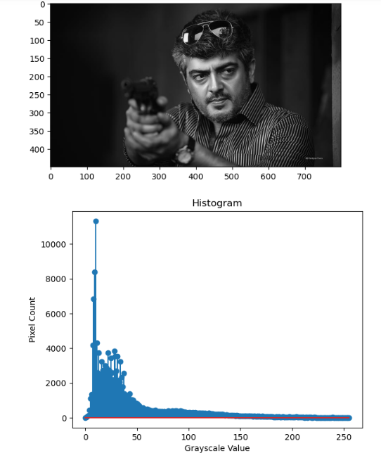
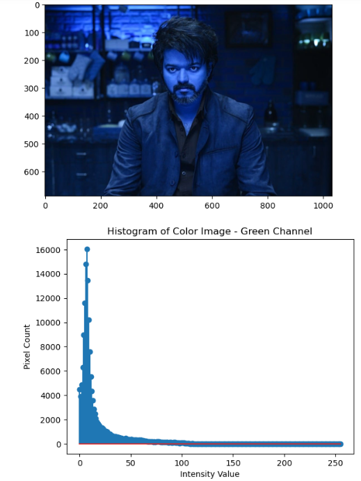

# Histogram-of-an-images
## Aim
To obtain a histogram for finding the frequency of pixels in an Image with pixel values ranging from 0 to 255. Also write the code using OpenCV to perform histogram equalization.

## Software Required:
Anaconda - Python 3.7

## Algorithm:
### Step1:
Read the gray and color image using imread()

### Step2:
Print the image using imshow().

### Step3:
Use calcHist() function to mark the image in graph frequency for gray and color image.

### step4:
Use calcHist() function to mark the image in graph frequency for gray and color image.

### Step5:
The Histogram of gray scale image and color image is shown.

## Program:
```python
# Developed By: ANISH RAJ P
# Register Number: 212222230010

import cv2
import matplotlib.pyplot as plt
gray_image = cv2.imread("Ajith.jpg")
color_image = cv2.imread("Vijay.jpg",-1)
gray_image = cv2.resize(gray_image,(300,400))
color_image = cv2.resize(color_image,(400,200))
cv2.imshow("Gray Image",gray_image)
cv2.imshow("Colour Image",color_image)
cv2.waitKey(0)
cv2.destroyAllWindows()

import numpy as np
Gray_image = cv2.imread("Ajith.jpg")
Color_image = cv2.imread("Vijay.jpg")
import matplotlib.pyplot as plt
gray_hist = cv2.calcHist([gray_image],[0],None,[256],[0,256])
color_hist = cv2.calcHist([color_image],[0],None,[256],[0,256])
plt.figure()
plt.imshow(Gray_image)
plt.show()
plt.title("Histogram")
plt.xlabel("Grayscale Value")
plt.ylabel("Pixel Count")
plt.stem(gray_hist)
plt.show()

plt.imshow(Color_image)
plt.show()
plt.title("Histogram of Color Image - Green Channel")
plt.xlabel("Intensity Value")
plt.ylabel("Pixel Count")
plt.stem(color_hist)
plt.show()

gray_image = cv2.imread("Ajith.jpg",0)
cv2.imshow('Gray Scale Image',gray_image)
equ = cv2.equalizeHist(gray_image)
cv2.imshow("Equalized Image",equ)
cv2.waitKey(0)
cv2.destroyAllWindows()
```
## Output:
### Input Grayscale Image and Color Image


### Histogram of Grayscale Image and any channel of Color Image


### Histogram Equalization of Grayscale Image.


## Result: 
Thus the histogram for finding the frequency of pixels in an image with pixel values ranging from 0 to 255 is obtained. Also,histogram equalization is done for the gray scale image using OpenCV.
